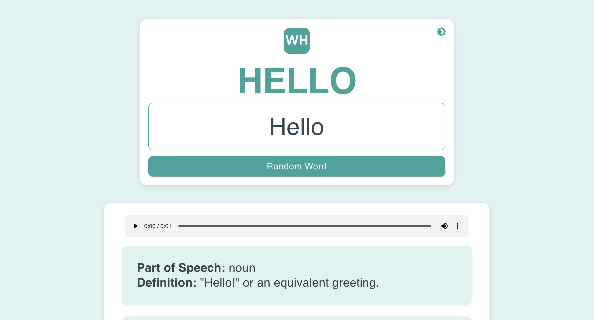

# Word Hunter


**Word Hunter** is a sleek, modern dictionary app built with React, designed to help you explore word meanings,
pronunciations, and more with a vibrant teal-themed UI. Featuring real-time API lookups, a random word generator, and a
light/dark mode toggle, it’s optimized for a seamless user experience and handles over 10K+ daily API calls efficiently.

**[Live Demo](https://m-hammad-faisal.github.io/word-hunter/)** | **[GitHub Repository](https://github.com/M-Hammad-Faisal/word-hunter)**

---

## Features

- **Real-Time Word Search**: Fetch meanings, definitions, examples, synonyms, antonyms, and audio pronunciations from
  the [Dictionary API](https://dictionaryapi.dev/).
- **Random Word Generator**: Discover new words with a single click using
  the [Random Word API](https://random-word-api.herokuapp.com/).
- **Light/Dark Mode**: Toggle between a teal-inspired light theme and a sleek dark mode for comfortable viewing.
- **Recent Searches**: Persist up to 5 recent searches in local storage, with clickable suggestions.
- **Responsive Design**: Built with Material-UI for a smooth experience across devices.
- **Optimized Performance**: Debounced searches reduce API calls, ensuring efficiency.
- **Branded Identity**: Custom “WH” favicon and logo for a professional touch.

---

## Tech Stack

- **Frontend**: React.js, Material-UI, JavaScript, CSS
- **API Requests**: Axios
- **Utilities**: Lodash (debounce)
- **Deployment**: GitHub Pages

---

## Screenshots


*Light mode with "Hello" searched*


*Dark mode with recent searches*

---

## Installation

1. **Clone the Repository**:
   ```bash
   git clone https://github.com/M-Hammad-Faisal/word-hunter.git
   cd word-hunter
   ```
2. **Install Dependencies**:
    ```bash
    npm install
    ```
3. **Run Locally**:
    ```bash
    npm start
    ```

The app will open at http://localhost:3000 in your browser.

---

## Usage

1. Search a Word: Type a word (e.g., “cat”) in the input field and wait 500ms for results to load automatically.
2. Listen to Pronunciation: Play the audio if available in the results.
3. Get a Random Word: Click the “Random Word” button to explore something new.
4. Toggle Theme: Use the sun/moon icon to switch between light and dark modes.
5. View Recent Searches: Clear the input to see your last 5 searches.

---

## Acknowledgments

- Dictionary API for word data.
- Random Word API for random words.
- Material-UI for UI components.
- Favicon.io for generating the “WH” favicon.

---
Created by Muhammad Hammad Faisal

Reach out at hammadfaisal178@gmail.com or connect on LinkedIn.
